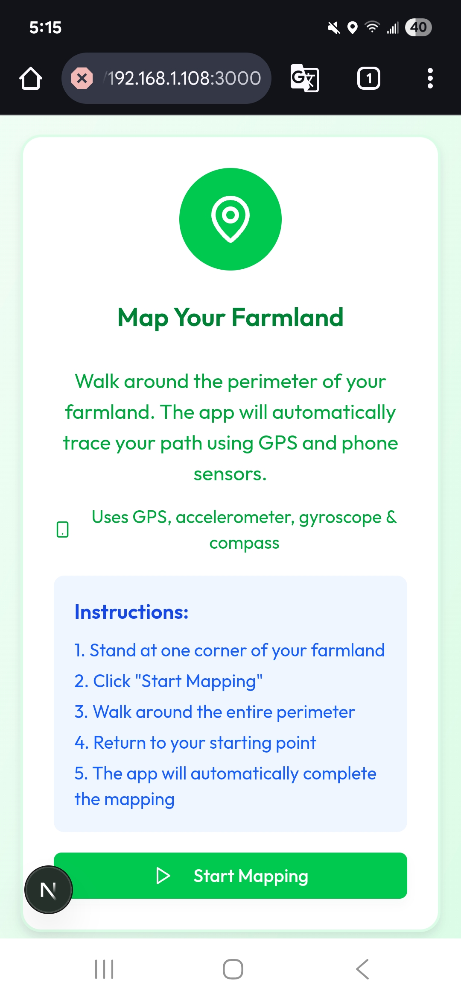
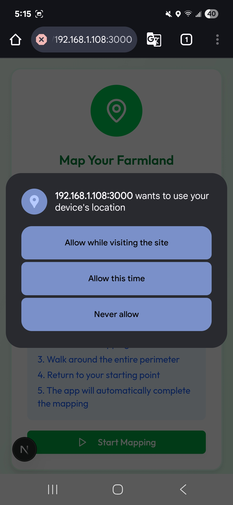
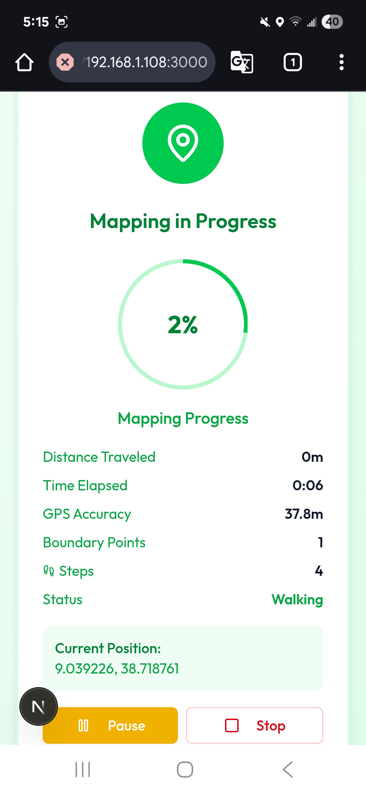

# 🌾 AgriLo – Your AI Extension Worker in Your Pocket

## 📌 Overview

AgriLo is the **first fully agentic AI agriculture assistant** designed for **smallholder farmers**, to get **personalized, real-time farming guidance** just by talking or sending a voice note. No more charts, no complex dashboards, AgriLo understands your needs and responds with **clear, actionable solutions** in your language.

---

## 🌍 Problem

These smallholder farms play a major role in food production. They operate around 12% of global farmland but produce about one-third of the world’s food. Yet the **farmer-to-extension-worker ratio** can be as bad as **1:10,000** in rural areas.

* **Gaps**: Limited access to timely weather, soil, and crop health information.
* **Existing tools**: Many digital agriculture apps are too technical, rely on raw charts, and ignore local languages/customs.
* **Impact**: Lower yields, missed climate adaptation opportunities, higher poverty risk — especially for **women farmers** who make up almost **50%** of the labor force.

---

## 💡 Our Solution

**AgriLo** acts as a **24/7 AI extension worker** that:

* Listens to the farmer’s needs (via **voice or text**)
* Understands local context (language, location, crop type)
* Automatically pulls real-time data (weather, soil, pests)
* Creates **weekly action plans** tailored to the farmer’s land and season

Farmers **don’t have to learn new technology** , they just **talk to AgriLo** and get answers.

---

## 🚀 How It Works

1. **Ask AgriLo** – The farmer speaks or types their question:

   > “Should I irrigate today?”
   > “What’s wrong with my maize leaves?”
2. **AgriLo Thinks for You** – Uses geolocation, weather forecasts, soil datasets, and crop health AI models to decide.
3. **Gives Clear Guidance** – E.g., “Don’t irrigate today, rain is expected tonight. Fertilize on Thursday.”
4. **Keeps Track** – Adds actions to a personalized AI calendar and sends reminders.


---

## 💵 Business Model

* **Government & NGO Partnerships** – Deploy AgriLo at scale as a low-cost extension service (100× cheaper than traditional agents).


## How It Works / Hands-On with the Production

To explore the web app, visit this link:  
[https://agri-smart-pi.vercel.app](https://agri-smart-pi.vercel.app)  

Follow this guideline document to navigate the web app effectively:  
[User Guide](https://docs.google.com/document/d/e/2PACX-1vRU3JepnuOAvJMDdPzwCaxM81nuttMNrVpFQouQnxJzOCtis7a6e9AqmPD9el67K6Tjlq-_NqCqyd3C/pub)


## 🚀 Further technical development/scale (already started)

We tried to implement a user-friendly approach for farmers to input their land boundaries. This is a **GPS-based land mapping feature** that uses the phone's sensors to automatically trace the farmland perimeter, area and location. So no need for map drawing on the phone. But we faced a time shortage for the integration of the system to the current project. So we have a plan to continue in the integration of this important feature, but it is still accessible for testing in the `location_setter` branch in the GitHub. (Screenshot of the implementation test is available.)

<table>
  <tr>
    <td></td>
       <td>
</td>
    <td></td>
   
  </tr>
</table>


- **Include SMS and USSD methods** to deliver data to farmers who do not have access to the internet or do not use a smartphone.
- We planned to design **Symbolic AI** – so that our app would provide real accurate data. Since AI models are generic and sensitive to error margin
- We managed to test an AI model that can run offline without any internet access that can answer and chat with the farmers in agriculture. So in future we plan to design an app so that farmers can interact with our app without any internet bundle.

**Test Model:**      **Ollama run sike_aditya/AgriLlama**
This model can give suggestions on the disease of the plant and some agricultural advice. But we aim to have more robust AI that is an agricultural specialist, so we might need more resources to fine-tune another base model using agricultural datasets, and we plan to use **tensorflow lite** to minimize and quantize the size and complexity of the fine-tuned model. (We have tested on the **tensorflow lite** method and it is promising, for testing the **tensorflow-lite-test** branch.) For now, we decided to stick with **Gemini**.

**Colab Link** that we experimented on tensorflow lite: 
https://colab.research.google.com/drive/158-rip9q8HwslSV-YDm83DNo37E9L37x?usp=sharing

By using **AI agent** we can utilize automation so that the farmer schedule just by ai chat instruction, which it provides weekly report on the field

## 🔮 Further (Special) Feature development

Connect with **NGOs and Agricultural Financial advisors** so that we can empower small-scaled farmers to achieve their economic stability.

We plan to add one more feature called **"MarketPlace"**, it is where farmers receive contracts from government, and private companies, allowing them to sell their crops at fair price and market demand.

## 🛠️ Used Technology:

**NextJs (Frontend)**

**FastAPI (Backend)**

**Pydantic (Data Validation)**

**Postgres (Database)**

**Gemini (AI)**

**Figma (Design)**

**Material Design/Symbol and Google Font (Design)**

## 🔌 APIs and Resources Used

We integrated several APIs to support smart, data-driven decisions in our project, with a strong focus on agricultural insights. Our primary API is the **OpenEPI API**, which we complemented with additional APIs to enrich functionality:

**Soil Recommendations**
 ```bash
   iSDA Soil API** (via OpenEPI)
   SoilGrids API** (via OpenEPI)
   
   ```
**Geocoding**
 ```bash
   OpenEPI Geocoding API** (via OpenEPI)
   
   ```
**Crop Health Diagnosis**
 ```bash
 OpenEPI Crop Health Model API** (via OpenEPI)
Deepleaf API
Kindwise API  
   ```
**Weather Forecasting**
 ```bash
OpenMetro Weather API
   ```


🔧 **Additional Tools and Services**

**Google Cloud Translation API** – for multilingual support

**Google Cloud Text-to-Speech (TTS)** – to assist low-literacy users

**Google Maps API** – for farmland mapping

## 🚀 How to Run the Project

### Backend Setup

1. **Navigate to backend directory:**
   ```bash
   cd backend
   ```

2. **Create and activate virtual environment:**
   ```bash
   python -m venv venv
   # On Windows:
   venv\Scripts\activate
   # On macOS/Linux:
   source venv/bin/activate
   ```

3. **Install dependencies:**
   ```bash
   poetry install
   ```

3. **Run the FastAPI server:**
   ```bash
   uvicorn src.main:app --reload
   ```

4. **Access the API documentation:**
   - Open your browser and go to: `http://127.0.0.1:8000/docs`
   - This will show the interactive API documentation

### Frontend Setup

1. **Navigate to frontend directory:**
   ```bash
   cd frontend
   ```

2. **Install dependencies:**
   ```bash
   npm install
   ```

3. **Run the development server:**
   ```bash
   npm run dev
   ```

4. **Access the application:**
   - Open your browser and go to: `http://localhost:3000`
   - The AgriLo application will be running


### Environment Variables

To run this project, you need to set up the following environment variables:

```bash
# API Keys
KINDWISE_API_KEY=your_kindwise_api_key_here
GOOGLE_API_KEY=your_google_api_key_here
DEEPL_API_KEY=your_deepl_api_key_here
TAVILY_API_KEY=your_tavily_api_key_here
DETECT_LANGUAGE_API=your_detect_language_api_key_here
GOOGLE_MAPS_API_KEY=your_google_maps_api_key_here

# Database Credentials
ISDA_USERNAME=your_isda_username_here
ISDA_PASSWORD=your_isda_password_here

# Security
JWT_SECRET_KEY=your_jwt_secret_key_here

# Google Cloud Platform
GCP_CREDENTIALS_B64=your_base64_encoded_gcp_credentials_here
```

**Note:** Create a `.env` file in the backend directory and add these environment variables with your actual API keys and credentials.

### Prerequisites

- **Node.js** (v16 or higher)
- **Python** (v3.8 or higher)
- **Poetry** (for backend dependency management)


**AgriLo – Farming Made Simple, One Conversation at a Time.**


